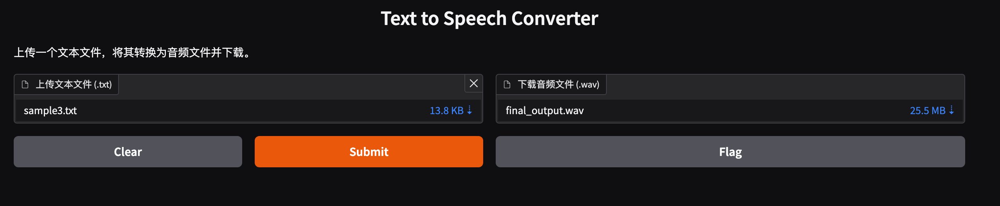

# Text-to-Speech Converter

这是一个使用Azure语音服务和Gradio构建的文本到语音转换器。



## 特性

- 上传文本文件并将其转换wav音频文件
- 支持长文本，自动分割并合并音频
- 简单的Web界面，易于使用
- 支持多种语言
- 支持多种音色 https://learn.microsoft.com/en-us/azure/ai-services/speech-service/language-support?tabs=tts
- 参考Azure语音服务文档 https://learn.microsoft.com/en-us/azure/ai-services/speech-service/get-started-text-to-speech?tabs=macos%2Cterminal&pivots=programming-language-python

## 功能

- 上传文本文件并将其转换为MP3音频文件
- 支持长文本，自动分割并合并音频
- 简单的Web界面，易于使用

## 安装

1. 克隆仓库：

```bash
git clone https://github.com/SharkTal/text-to-speech-converter.git

cd text-to-speech-converter
```

2. 安装依赖：

```bash
pip install -r requirements.txt
```

3. 设置Azure语音服务凭证：
在系统环境变量中设置 `SPEECH_KEY` 和 `SPEECH_REGION`。
```bash
export SPEECH_KEY=your-key
export SPEECH_REGION=your-region
```
## 使用

运行以下命令启动应用：

```
python speech_synthesis_v3.py
```


然后在浏览器中打开显示的URL，上传文本文件并下载生成的音频文件。

## 注意事项

确保你的系统中安装了ffmpeg，这是生成MP3文件所必需的。


# Text-to-Speech Converter

This is a text-to-speech converter built using Azure Speech Services and Gradio.

## Features

- Upload text files and convert them to MP3 audio files
- Support for long texts with automatic splitting and merging of audio
- Simple web interface for easy use
- Support for multiple languages
- Support for multiple voices， [https://techcommunity.microsoft.com/blog/azure-ai-services-blog/9-more-realistic-ai-voices-for-conversations-now-generally-available/4099471](https://learn.microsoft.com/en-us/azure/ai-services/speech-service/language-support?tabs=tts)
- Refer to Azure Speech Services documentation https://learn.microsoft.com/en-us/azure/ai-services/speech-service/get-started-text-to-speech?tabs=macos%2Cterminal&pivots=programming-language-python


## Installation

1. Clone the repository:

```bash
git clone https://github.com/SharkTal/text-to-speech-converter.git 
cd text-to-speech-converter
```

2. Install dependencies:

```
pip install -r requirements.txt
```


3. Set up Azure Speech Service credentials:
Set `SPEECH_KEY` and `SPEECH_REGION` as system environment variables.

```bash
export SPEECH_KEY=your-key
export SPEECH_REGION=your-region
```

## Usage

Run the following command to start the application:

```bash
python speech_synthesis_v3.py
```

Then open the displayed URL in your browser, upload a text file, and download the generated audio file.

## Requirements

- Python 3.7+
- Azure Speech Services account
- ffmpeg (necessary for MP3 OR WAV file generation)

## Note

Ensure that ffmpeg is installed on your system, as it is required for generating MP3 files.

## Contributing

Contributions, issues, and feature requests are welcome. Feel free to check [issues page](https://github.com/yourusername/text-to-speech-converter/issues) if you want to contribute.

## License

[MIT](https://choosealicense.com/licenses/mit/)

## Author

SharkTal


